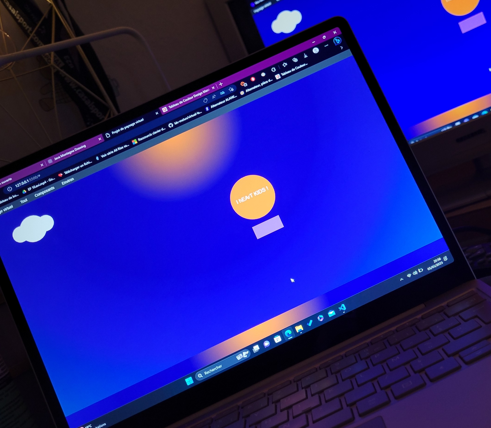
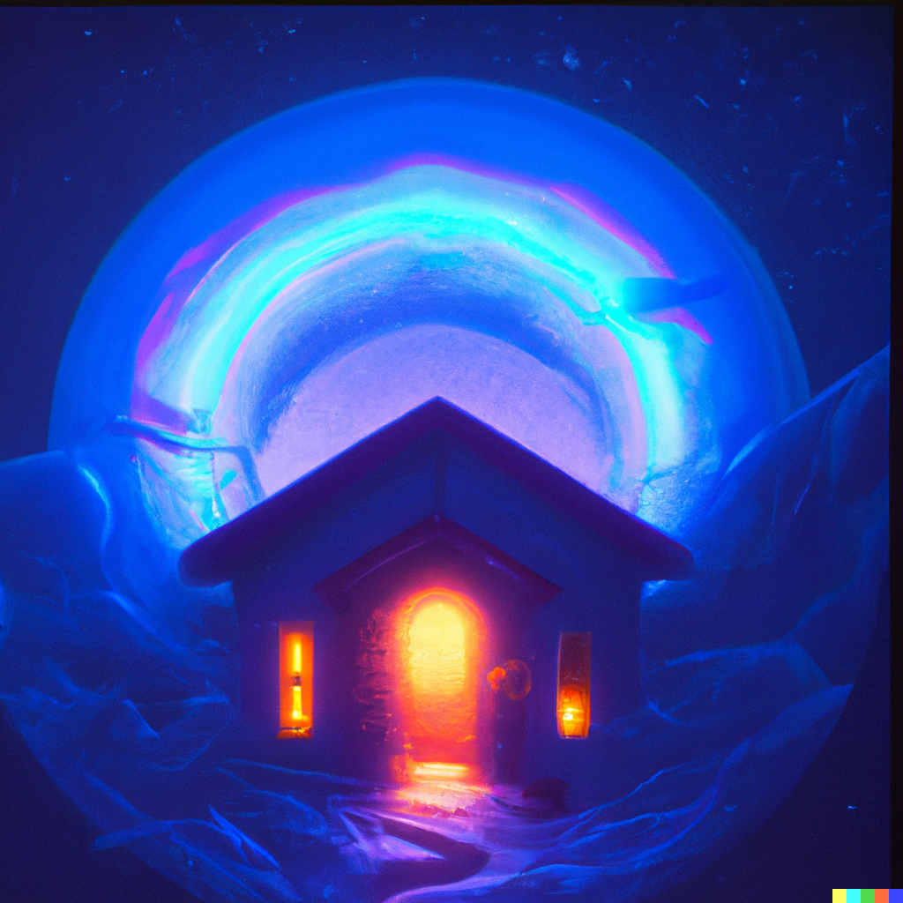
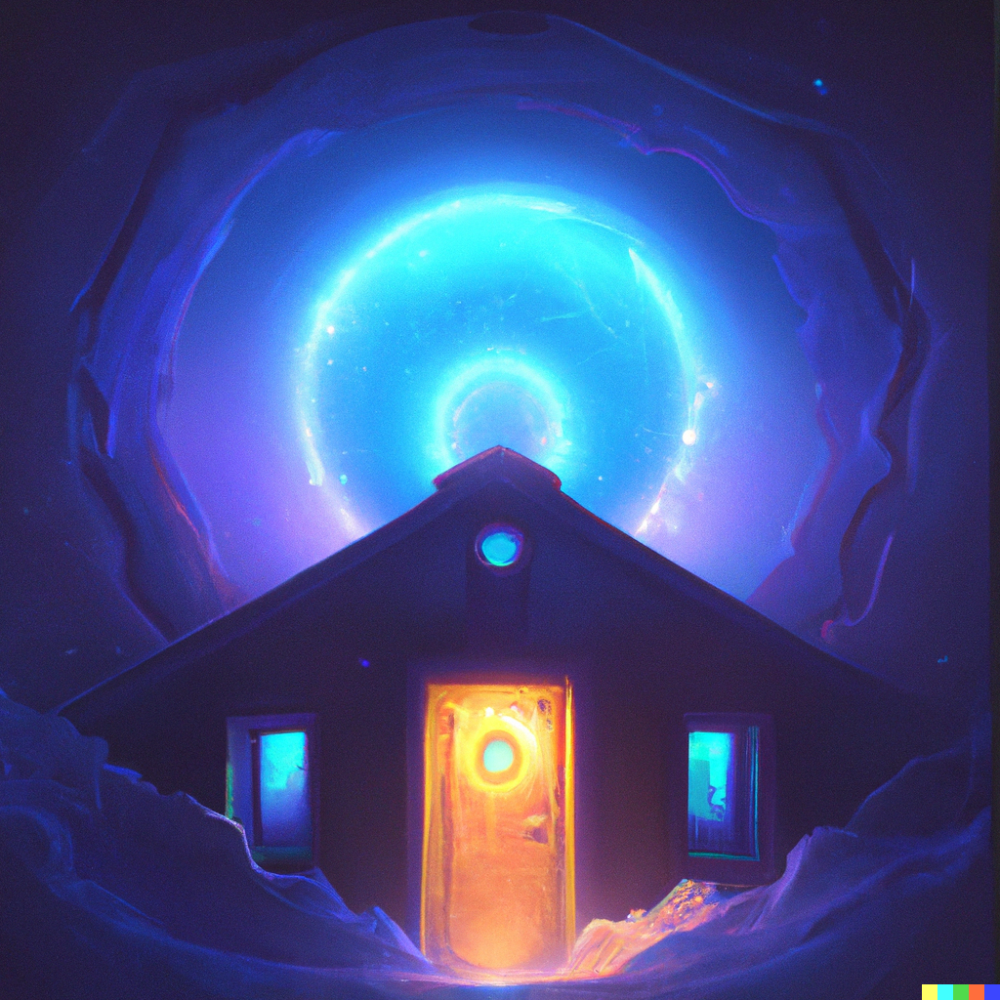
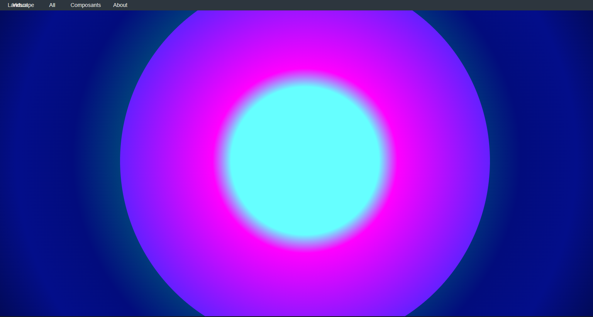
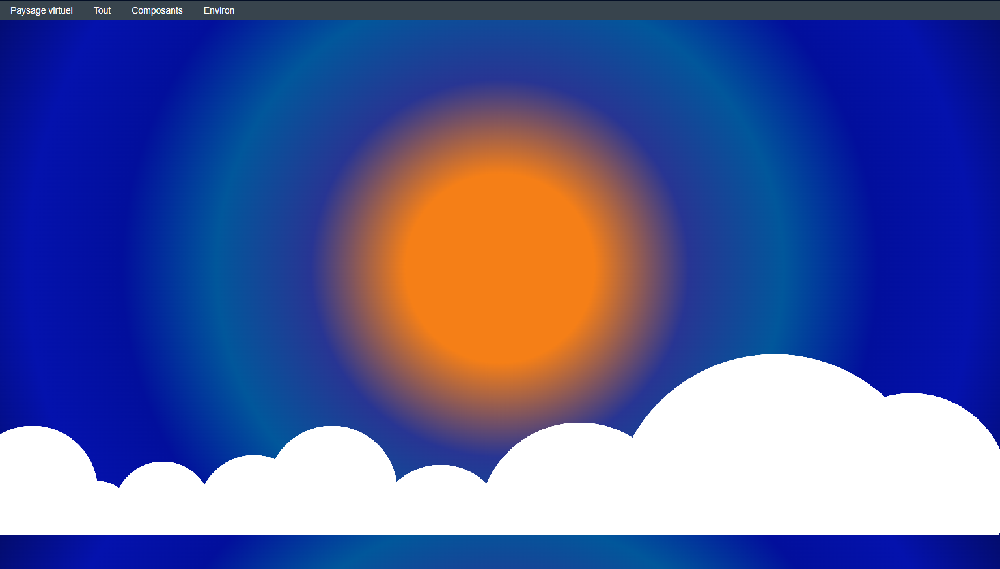
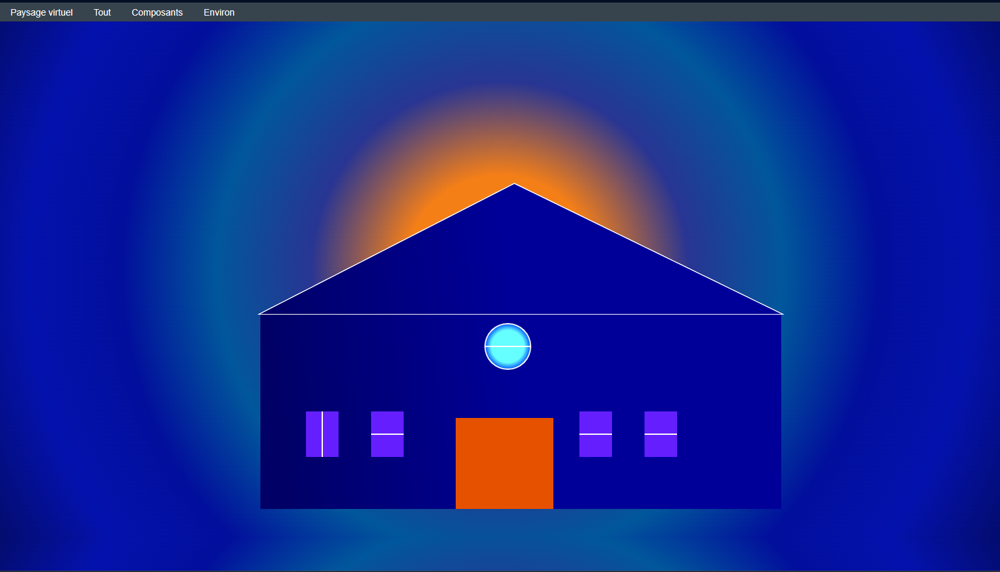
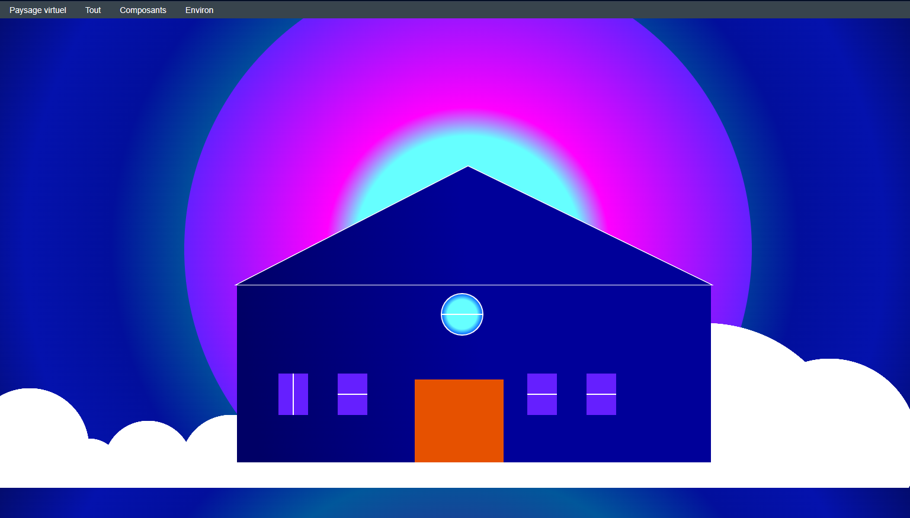

# Compte rendu du paysage virtuel 

## I/ Idée N°1 

1. La première idée que j'avais pour ce devoir étais de faire un coucher de soleil qui se reflète sur la mer avec plusieurs éléments autour. 
Pour faire le coucher du soleil, je me suis aidée de la fonction background du layout pour le placement des couleurs et du font pour "agrandir le sol ".


```css
font:14px/00 Arial,sans-serif;
background:radial-gradient( farthest-corner circle at center, #F57F17, #F57F17, #283593, #01579B, #020f9c, #0412ad, #030c6e)
```

2. Lors de l'élaboration de de mon premier paysage virtuel je me suis rendu compte que certain élément que je voulais ajouter était trop complexe à faire alors ce paysage devenait de plus en plus vide et ça ne me plaisais plus alors j'ai décider de tout recommencer à zéro.   

### Le Resultat:



## II/ Retour à zéro et les diffcicultés

1. Une fois recommencer à zéro j'ai eu envie d'essayer de reproduire au maximum une image que j'ai moi même générer avec DALL.E 





Pour le fond bleu, j'ai repris les mêmes couleurs que le layout. J'ai effectué un cercle avec plusieurs couleurs pour faire le dégrader de mon portail.


```javascript

draw(ctx){
 
//Création de dégrader
var gradient1 = ctx.createRadialGradient(790, 390, 0, 790, 390, 479);
gradient1.addColorStop(1, '#651FFF');//couleur n1 (le grand cercle)
gradient1.addColorStop(0.5, '#FF00FF'); // couleur n2 
gradient1.addColorStop(0.4, '#66FFFF');// couleur n3 du millieu

ctx.beginPath()
ctx.strokeStyle= this.StrokeColor
ctx.fillStyle= this.fillColor
ctx.fillStyle = gradient1; // application du dégrader
ctx.arc(790, 390, 479, 0, 2 * Math.PI); // position du cercle
ctx.fill();
ctx.closePath();
}
```
### Le Résultat :



Cela m'a pris beaucoup de temps pour placer les couleurs, trouver les bonnes tailles, le bon placement et que le tout s'affiche correctement.


## III/ Les éléments du décore

1. Le premier élément de mon décore était la neige. Pour faire la neige j’ai réutilisé le code du ballon de ma première idée et réadapter le code pour qu’il y en ai plusieurs de taille différente et que celle-ci passe derrière la maison.

```javascript

 draw(ctx){
// Boule de Neige 1 Gauche
ctx.fillStyle = 'white'; //Couleur
ctx.beginPath();
ctx.arc(50, 725, 100, 0, 2 * Math.PI); // Emplacement de la neige
ctx.fill();
ctx.closePath();

// Boule de Neige 9 Droite
ctx.fillStyle = 'white'; //Couleur
ctx.beginPath();
ctx.arc(1400, 725, 150, 0, 2 * Math.PI); // Emplacement de la neige
ctx.fill();
ctx.closePath();
}
```

### Le Résultat :



2. La construction de la maison a été assez rapide, mais j’ai eu quelques problèmes avec la ligne mes fenêtres et le toit. 
Une fois les modifications faites, le moment de venu de placer tout ces éléments à leur place respectif sauf qu’une fois les valeurs mises les modifications ne sont plus les mêmes alors il faut tout changer.

3. Pour les dégrader de ma maison je voulais que mes fenêtres prennent le dégrader de mon portail à l’arrière de ma maison, mais je n’ai pas réussi je me suis contenter d’utiliser les couleurs du portail et de les appliquer sur les fenêtres pour faire un semblant de dégrader.

### Le Résultat :



```javascript

//création de dégrader toit et mur
var gradient = ctx.createLinearGradient(400, 450, 790, 400, 450, 0);
gradient.addColorStop(1, '#000099');
gradient.addColorStop(0, '#000066');

// Le mur avant 
ctx.fillStyle = gradient; // couleur du mur
ctx.fillRect(400, 450, 800, 300); // emplacement du mur

//toit de la maison
ctx.beginPath();
ctx.moveTo(790, 250);
ctx.lineTo(400, 450);
ctx.lineTo(400, 450);
ctx.lineTo(1200, 450);
ctx.lineTo(790, 250);
ctx.stroke()
ctx.fillStyle = gradient; // Couleur
ctx.fill();
ctx.closePath();

```
  Les dégradés

```Javascript
// La fenêtre n1 Droite 
ctx.fillStyle = '#651FFF';
ctx.beginPath();
ctx.fillRect(890, 600, 50, 70);
ctx.moveTo(915 - 25, 635);
ctx.lineTo(915 + 25, 635 );
ctx.strokeStyle = "#fff";
ctx.lineWidth = 2;
ctx.stroke();
ctx.fill()
ctx.closePath();

//dégradé Fenêtre Ronde
var gradient4 = ctx.createRadialGradient(780, 500, 25, 780, 500, 35);
gradient4.addColorStop(0, '#66FFFF');
gradient4.addColorStop(1, '#0055FF');

//Fenêtre Ronde n4
ctx.fillStyle = gradient4;
ctx.beginPath();
ctx.arc(780, 500, 35, 0, 2 * Math.PI);
ctx.lineTo(745, 500 );
ctx.lineTo(745, 500 );
ctx.moveTo(780,500);
ctx.fill()
ctx.stroke()
ctx.closePath();
}
```

## Le Résultat Final du projet : 
Ce n'est pas exactement la même chose que l'idée d'origine mais c'est un début.




# Lien Github
https://github.com/Oceane-Lufundu/virtual-landscape.git


"# Projet_2" 
